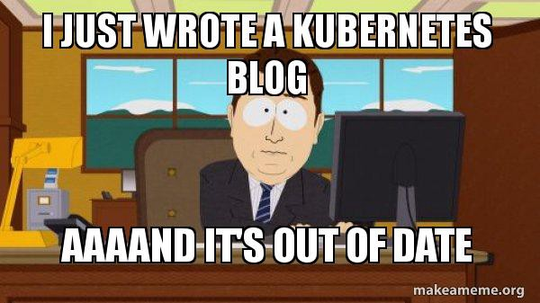

# ft_services

### Disclaimer

This project is a school assignment. It was done for **learning purposes** and is thus **not intended for production**.  
Don't copy. Learn.  

## Components

- minikube v1.18.1
- kubectl v1.20.2
- Alpine 3.13
- NGINX 1.18.0-r13
- MariaDB 10.5.8
- PHP 7.4.15-r0
- phpMyAdmin 5.1.0
- WordPress 5.7
- vsftpd 3.0.3-r6
- InfluxDB 1.8.3-r2
- Grafana 7.3.6-r0
- Telegraf 1.17.0-r0
- openssl 1.1.1

## Usage

## Prerequisites

This project is to be run inside 42's VM.

  

### Acknowledgements

School project done at [42 Paris](https://www.42.fr).

WordPress theme: [Cyanotype](https://wordpress.org/themes/cyanotype/) By Automattic.
