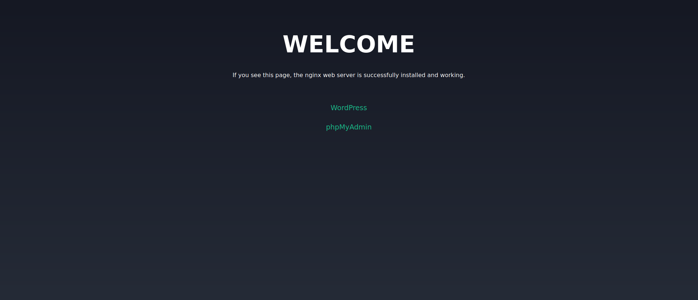
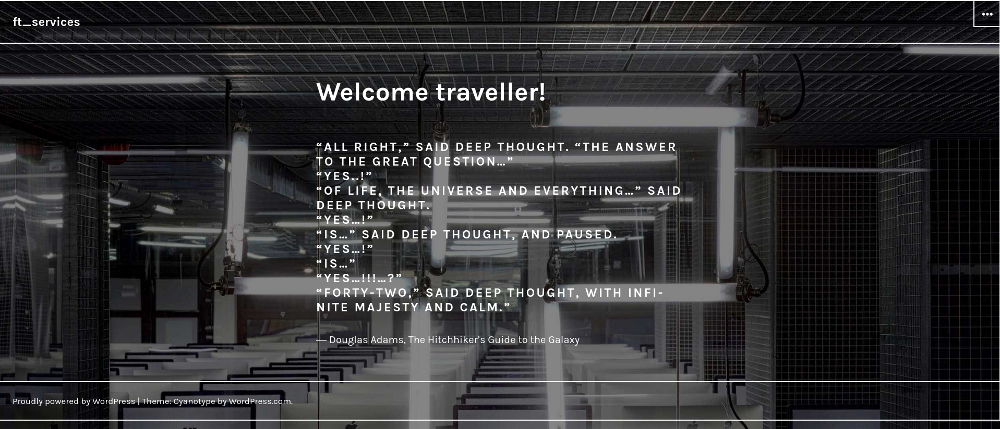
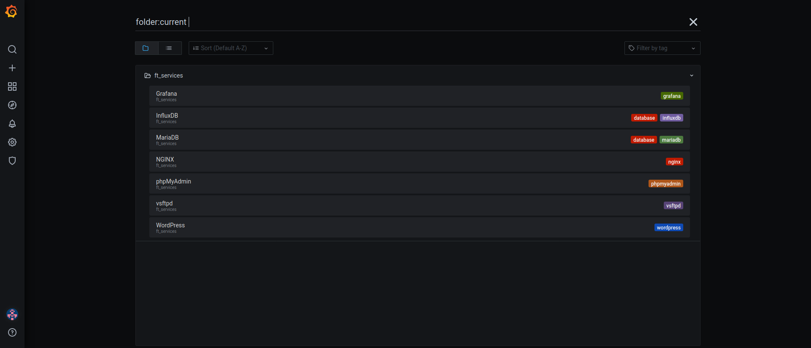
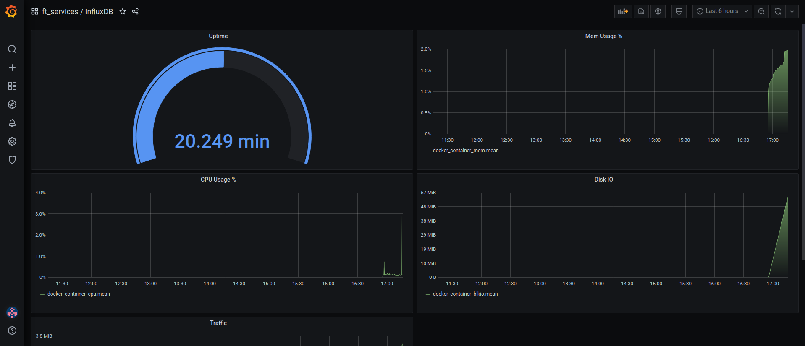

# ft_services

`ft_services` is an individual school project at [42 Paris](https://www.42.fr) campus.

42 is a private, non-profit and tuition-free Computer Science school based on peer-to-peer learning and hands-on projects.

> Set up a Kubernetes cluster. 

### Disclaimer

This project is a school assignment. It was done for **learning purposes** and is thus **not intended for production**.  
Don't copy. Learn.  

## Components

- minikube v1.18.1
- kubectl v1.20.2
- Alpine 3.13
- NGINX 1.18.0
- MariaDB 10.5.9
- PHP 7.4.15
- phpMyAdmin 5.1.0
- WordPress 5.7
- vsftpd 3.0.3-r6
- InfluxDB 1.8.3
- Grafana 7.3.6
- Telegraf 1.17.0

## Usage

This project is to be run inside 42's VM.

### Prerequisites

- 42's VM with 2 CPUs
- Docker 18.09 or higher

Add `user42` to the docker group:

```console
sudo usermod -aG docker $(whoami)
su $(whoami)
service docker restart
```

### Common tasks

```console
# Using Makefile
make all

# Using the script required by the assignment
sh setup.sh
```

* `make install` installs minikube and kubectl
* `make start` start cluster and enables necessary addons

## Preview

<p align="center">
   
   
</p>

### Acknowledgements

School project done at [42 Paris](https://www.42.fr).

WordPress theme: [Cyanotype](https://wordpress.org/themes/cyanotype/) By Automattic.
