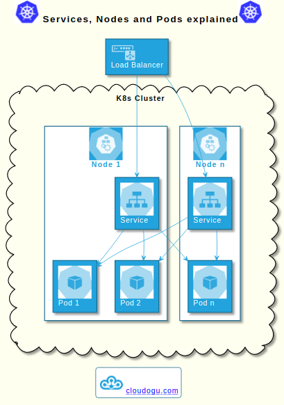
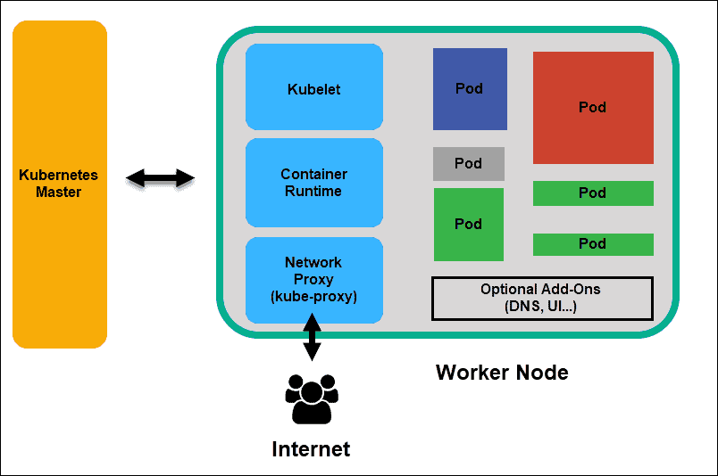
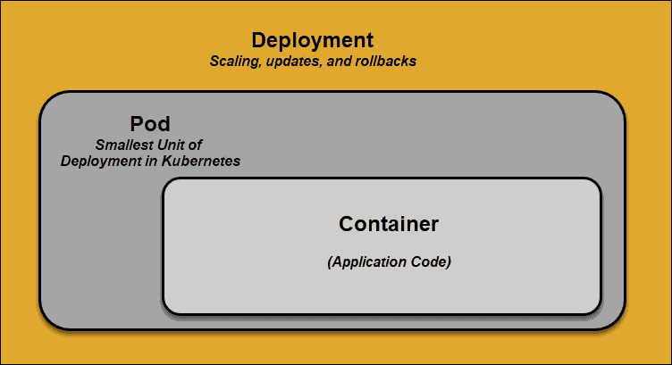

# Kubernetes

> Kubernetes is a tool used to manage clusters of containerized applications. In computing, this process is often referred to as orchestration.  Much as a conductor would, Kubernetes coordinates lots of microservices that together form a useful application. Kubernetes automatically and perpetually monitors the cluster and makes adjustments to its components.  
Kubernetes, or k8s for short, is a system for automating application deployment. Modern applications are dispersed across clouds, virtual machines, and servers. Administering apps manually is no longer a viable option.  
K8s transforms virtual and physical machines into a unified API surface. A developer can then use the Kubernetes API to deploy, scale, and manage containerized applications. [(Source)](https://phoenixnap.com/kb/understanding-kubernetes-architecture-diagrams)  

It was originally designed by Google and is now maintained by the Cloud Native Computing Foundation. [(Source)](https://en.wikipedia.org/wiki/Kubernetes)

We interact with the Kubernetes API that gives access to the resources describing the [cluster](https://en.wikipedia.org/wiki/Computer_cluster) configuration.

Kubernetes has a decentralized architecture that does not handle tasks sequentially. It functions based on a declarative model and implements the concept of a ‘desired state.’ These steps illustrate the basic Kubernetes process:

1. An administrator creates and places the desired state of an application into a manifest file.
2. The file is provided to the Kubernetes API Server using a CLI or UI. Kubernetes’ default command-line tool is called kubectl. In case you need a comprehensive list of kubectl commands, check out our Kubectl Cheat Sheet.
3. Kubernetes stores the file (an application’s desired state) in a database called the Key-Value Store (etcd).
4. Kubernetes then implements the desired state on all the relevant applications within the cluster.
5. Kubernetes continuously monitors the elements of the cluster to make sure the current state of the application does not vary from the desired state.

  

Source: [phoenixNAP: Understanding Kubernetes Architecture With Diagrams](https://phoenixnap.com/kb/understanding-kubernetes-architecture-diagrams)

## Objects

The following objects are stored in `etcd`.

- [node](https://kubernetes.io/docs/concepts/architecture/nodes/): a machine in the cluster
- [Pod](https://kubernetes.io/docs/concepts/workloads/pods/): multiple containers running on the same node and sharing the same resources
  - IP addresses are associated with pods, not with individual containers [(source)](https://container.training/kube-selfpaced.yml.html)
- [Service](https://kubernetes.io/docs/concepts/services-networking/service/): stable endpoint to connect to an application (multiple pods) from the outside of the cluster
- [Deployments](https://kubernetes.io/docs/concepts/workloads/controllers/deployment/): describe how identical instances of a Pod are executed
- [Roles and ClusterRoles](https://kubernetes.io/docs/reference/access-authn-authz/rbac/): describe permissions
- RoleBindings or ClusterRoleBindings: grant the permissions described by a Role or ClusterRole to a user or a service
- [NetworkPolicies](https://kubernetes.io/docs/concepts/services-networking/network-policies/): describe filtering rules to apply between pods, or between a pod and external services
- [PodSecurityPolicy](https://kubernetes.io/docs/concepts/policy/pod-security-policy/): describes cluter-level security policies

`etcd` : the backend for service discovery and stores cluster state and configuration
`kubectl`: CLI tool Kubernetes API

  

  

Images source: [k8s-diagrams](https://github.com/cloudogu/k8s-diagrams)

## Master node

- container orchestration layer of a cluster
- ensures communication within the cluster
- load balances workloads

The Kubernetes Master (Master Node) receives input from a CLI (Command-Line Interface) or UI (User Interface) via an API. These are the commands you provide to Kubernetes.

You define pods, replica sets, and services that you want Kubernetes to maintain. For example, which container image to use, which ports to expose, and how many pod replicas to run.

You also provide the parameters of the desired state for the application(s) running in that cluster.

|                        | Master Node            |
| ---------------------- | ---------------------- |
| API Server             | The API Server communicates with all the components within the cluster. |
| Key-Value Store (etcd) | A light-weight distributed key-value store used to accumulate all cluster data. |
| Controller             | Uses the API Server to monitor the state of the cluster. It tries to move the actual state of the cluster to match the desired state from your manifest file. |
| Scheduler              | Schedules newly created pods onto worker nodes. Always selects nodes with the least traffic to balance the workload. |

Source: [phoenixNAP: What Is Kubernetes? Complete Guide](https://phoenixnap.com/kb/what-is-kubernetes)

  

Source: [phoenixNAP: Understanding Kubernetes Architecture With Diagrams](https://phoenixnap.com/kb/understanding-kubernetes-architecture-diagrams)

### API Server

The API Server is the front-end of the control plane and the only component in the control plane that we interact with directly. Internal system components, as well as external user components, all communicate via the same API.

### Key-Value Store (etcd)

The Key-Value Store, also called etcd, is a database Kubernetes uses to back-up all cluster data. It stores the entire configuration and state of the cluster. The Master node queries etcd to retrieve parameters for the state of the nodes, pods, and containers.

### Controller

The role of the Controller is to obtain the desired state from the API Server. It checks the current state of the nodes it is tasked to control, and determines if there are any differences, and resolves them, if any.

### Scheduler

A Scheduler watches for new requests coming from the API Server and assigns them to healthy nodes. It ranks the quality of the nodes and deploys pods to the best-suited node. If there are no suitable nodes, the pods are put in a pending state until such a node appears.

## Worker node

Worker nodes listen to the API Server for new work assignments; they execute the work assignments and then report the results back to the Kubernetes Master node.

There are multiple instances of Worker Nodes, each performing their assigned tasks. These nodes are the machines where the containerized workloads and storage volumes are deployed.

|                         | Worker Node            |
| ----------------------- | ---------------------- |
| Kubelet                 | A daemon that runs on each node and responds to the master’s requests to create, destroy, and monitor pods on that machine. |
| Container Runtime       | A container runtime retrieves images from a container image registry and starts and stops containers. This is usually a 3rd party software or plugin, such as Docker. |
| Kube-proxy              | A network proxy that maintains network communication to your Pods from within or from outside the cluster. |
| Add-ons (DNS, Web UI..) | Additional features you can add to your cluster to extend certain functionalities. |
| Pod                     | A pod is the smallest element of scheduling in Kubernetes. It represents a ‘wrapper’ for the container with the application code. If you need to scale your app within a Kubernetes cluster, you can only do so by adding or removing pods. A node can host multiple pods. |

Source: [phoenixNAP: What Is Kubernetes? Complete Guide](https://phoenixnap.com/kb/what-is-kubernetes)

  

Source: [phoenixNAP: Understanding Kubernetes Architecture With Diagrams](https://phoenixnap.com/kb/understanding-kubernetes-architecture-diagrams)

### Kubelet

The kubelet runs on every node in the cluster. It is the principal Kubernetes agent. By installing kubelet, the node’s CPU, RAM, and storage become part of the broader cluster. It watches for tasks sent from the API Server, executes the task, and reports back to the Master. It also monitors pods and reports back to the control panel if a pod is not fully functional. Based on that information, the Master can then decide how to allocate tasks and resources to reach the desired state.

### Container Runtime

The container runtime pulls images from a container image registry and starts and stops containers. A 3rd party software or plugin, such as Docker, usually performs this function.

### Kube-proxy

The kube-proxy makes sure that each node gets its IP address, implements local iptables and rules to handle routing and traffic load-balancing.

### Pod

A pod is the smallest element of scheduling in Kubernetes. Without it, a container cannot be part of a cluster. If you need to scale your app, you can only do so by adding or removing pods.

The pod serves as a ‘wrapper’ for a single container with the application code. Based on the availability of resources, the Master schedules the pod on a specific node and coordinates with the container runtime to launch the container.

  

In instances where pods unexpectedly fail to perform their tasks, Kubernetes does not attempt to fix them. Instead, it creates and starts a new pod in its place. This new pod is a replica, except for the DNS and IP address. This feature has had a profound impact on how developers design applications.

Due to the flexible nature of Kubernetes architecture, applications no longer need to be tied to a particular instance of a pod. Instead, applications need to be designed so that an entirely new pod, created anywhere within the cluster, can seamlessly take its place. To assist with this process, Kubernetes uses services.

### Kubernetes Services

Pods are not constant. One of the best features Kubernetes offers is that non-functioning pods get replaced by new ones automatically.

However, these new pods have a different set of IPs. It can lead to processing issues, and IP churn as the IPs no longer match. If left unattended, this property would make pods highly unreliable.

Services are introduced to provide reliable networking by bringing stable IP addresses and DNS names to the unstable world of pods.

By controlling traffic coming and going to the pod, a Kubernetes service provides a stable networking endpoint – a fixed IP, DNS, and port. Through a service, any pod can be added or removed without the fear that basic network information would change in any way.

Source: [phoenixNAP: Understanding Kubernetes Architecture With Diagrams](https://phoenixnap.com/kb/understanding-kubernetes-architecture-diagrams)
