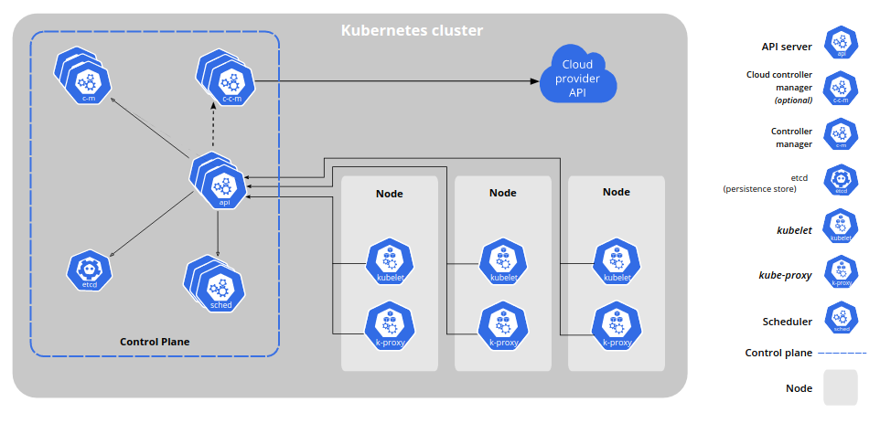

# Kubernetes

- Kubernetes
- k8s for short
- Container orchestration tool
- Manage containerized applications and automate their administration (deployment, scaling, monitoring, ...)
- Originally designed by Google and is now maintained by the [Cloud Native Computing Foundation](https://www.cncf.io/)

**Table of Contents**

1. [Components](#components)
2. [Process](#process)
3. [Services](#services)
4. [Configuration](#configuration)

## Components

  

Images source: [Kubernetes documentation: Kubernetes Components](https://kubernetes.io/docs/concepts/overview/components/)

Kubernetes cluster -> set of worker machines, called Nodes, and a Control Plane.

Control plane:
- Manages the cluster
- Contains:
  - [API server](https://kubernetes.io/docs/concepts/overview/components/#kube-apiserver)
  - [etcd](https://kubernetes.io/docs/concepts/overview/components/#etcd): Backups cluster data
  - [kube-scheduler](https://kubernetes.io/docs/concepts/overview/components/#kube-scheduler): Control plane component that watches for newly created Pods with no assigned node, and selects a node for them to run on
  - Controllers

Nodes:
- Host the Pods
- Contains:
  - [kubelet](https://kubernetes.io/docs/reference/command-line-tools-reference/kubelet/): The node agent
  - [kube-proxy](https://kubernetes.io/docs/reference/command-line-tools-reference/kube-proxy/): Network proxy
  - [Container runtime](https://kubernetes.io/docs/setup/production-environment/container-runtimes/): The software running containers (e.g., Docker)
  - Pods: Groups of one or more containers

### Objects

The following objects, or resources, are stored in `etcd` (key-value pairs database).

- [Node](https://kubernetes.io/docs/concepts/architecture/nodes/): a machine in the cluster
- [Pod](https://kubernetes.io/docs/concepts/workloads/pods/): a group of one or more containers running on the same node and sharing the same resources
  - IP addresses are associated with pods, not with individual containers [(source)](https://container.training/kube-selfpaced.yml.html)
- [Service](https://kubernetes.io/docs/concepts/services-networking/service/): stable endpoint to connect to an application (multiple pods) from the outside of the cluster
- [Deployments](https://kubernetes.io/docs/concepts/workloads/controllers/deployment/): describe how identical instances of a Pod are executed
- [Roles and ClusterRoles](https://kubernetes.io/docs/reference/access-authn-authz/rbac/): describe permissions
- RoleBindings or ClusterRoleBindings: grant the permissions described by a Role or ClusterRole to a user or a service
- [NetworkPolicies](https://kubernetes.io/docs/concepts/services-networking/network-policies/): describe filtering rules to apply between pods, or between a pod and external services
- [PodSecurityPolicy](https://kubernetes.io/docs/concepts/policy/pod-security-policy/): describes cluter-level security policies
- [ConfigMaps](https://kubernetes.io/docs/concepts/configuration/configmap/): used to separate configuration from code, representing configuration data as key-value pairs
- [PersistentVolumes and PersistentVolumeClaim](https://kubernetes.io/docs/concepts/storage/persistent-volumes/#reserving-a-persistentvolume): used to have a durable storage for data.

## Process

1. The developer defines the desired state of an application into files called manifests.
2. The manifests are provided to the Kubernetes API Server using `kubectl`, a CLI tool.
3. Kubernetes stores the manifests into `etcd`, a key-value pairs database.
4. Kubernetes implements the desired state in the cluster.
5. Kubernetes monitors the cluster to ensure the application stays in the desired state.

## Services

> Pods are not constant. One of the best features Kubernetes offers is that non-functioning pods get replaced by new ones automatically. Services are introduced to provide reliable networking by bringing stable IP addresses and DNS names to the unstable world of pods.  [(Source)](https://phoenixnap.com/kb/understanding-kubernetes-architecture-diagrams)

## Volumes

> A PersistentVolume (PV) is a piece of storage in the cluster [...].  
A PersistentVolumeClaim (PVC) is a request for storage by a user. It is similar to a Pod. Pods consume node resources and PVCs consume PV resources. Pods can request specific levels of resources (CPU and Memory). Claims can request specific size and access modes (e.g., they can be mounted ReadWriteOnce, ReadOnlyMany or ReadWriteMany, see AccessModes). [(Source)](https://kubernetes.io/docs/concepts/storage/persistent-volumes/)

Data is volatile. Volumes have a lifetime of a pod and are directories with data in them that are accessible to containers within a pod. When a pod ceases to exist, its volumes are destroyed.

PersistentVolumes are API object, cluster resources. They are persistent pieces of storage, which means they exist beyond the lifetime of a pod.  
PersistentVolumeClaim is a request for a PersistentVolume resource.

Dynamic provisioning: Instead of configuring manually a PersistentVolume, create a PersistentVolumeClaim so Kubernetes automatically provisions a persistent disk.

## Configuration

To configure your apps in Kubernetes, you can use:

- Environment variables
- ConfigMaps
- Secrets

> The Kubernetes API allows storing of information that may be interesting to workloads. For example, the Kubernetes API can be used to store secrets or config maps. Secrets could be any sensitive data that you wouldn’t want in your container images, including passwords, certificates and other sensitive information. And config maps can contain configuration information that should remain independent of container images, such as application startup and other similar parameters.  [(Source)](https://thenewstack.io/kubernetes-design-and-development-explained/)
